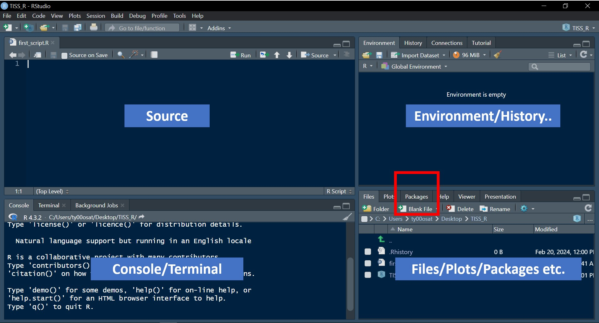

# Installing R packages
## Package
An R package is a library of functions that have been developed to cover some needs or specific scientific methods that are not implemented in base R.  

The Comprehensive R Archive Network (CRAN) is the official R packages repository, with thousands of free R packages available. Most of them have been developed by Data Scientists, Statisticians, Professors and researchers.  

First, you need to look for the name of the package you want to install. You may want to research for your topic googling something like: ‘graphics package R’ or ‘R package for time series’.  

Once you decided what package to install, just call the `install.packages` function with the name of the package inside the parenthesis `()` with quotation marks `" "` or `' '`. As an example, we are going to install the `calendR` package, that allows creating monthly and yearly calendars, but you can install the package you prefer.  

```{r}
# install.packages('calendR')
```


Once you see a similar looking message in the Console "The downloaded binary packages are in "drive user downloaded_packages", it is good idea to add a comment `#` before install.packages like this `# install.packages('calendR')` to avoid installing the same package again and again!

After installation, you need to load the package if you want to access its functions. For that purpose, you can load it with the `library` function, specifying the package name with or without quotation marks.

```{r}
library(calendR)
```

Once loaded, you can use `?` or the `help` function with the package name or the name of any function to see the documentation. You will also find useful examples to understand how the package works.  

`?calendR`  
`help("calendR")`  
`help(calendR)`  

In addition, you can find out where the packages are going to be installed calling the `.libPaths()` function.

```{r}
.libPaths()
```

Alternatively, you can install R packages from the menu (Package).

```{r, echo= FALSE, out.width= "70%", fig.align='center', fig.cap= 'Package'}
  
```

In RStudio go to Tools → Install Packages and in the Install from option select Repository (CRAN) and then specify the packages you want.  

If you need to install several packages at once without writing the same function over and over again, you can make use of the c function within the `install.packages` function. Note that now the quotation marks are needed to specify the packages names. 

`install.packages(c("ggplot2", "dplyr"))`

Once installed, you can get a list of all the functions in the package. If the package is on CRAN, you will find documentation in PDF format of all functions inside a page like https://cran.r-project.org/web/packages/package_name. Recall you can access this documentation in HTML format with the help function.

`help(package = ggplot2)`