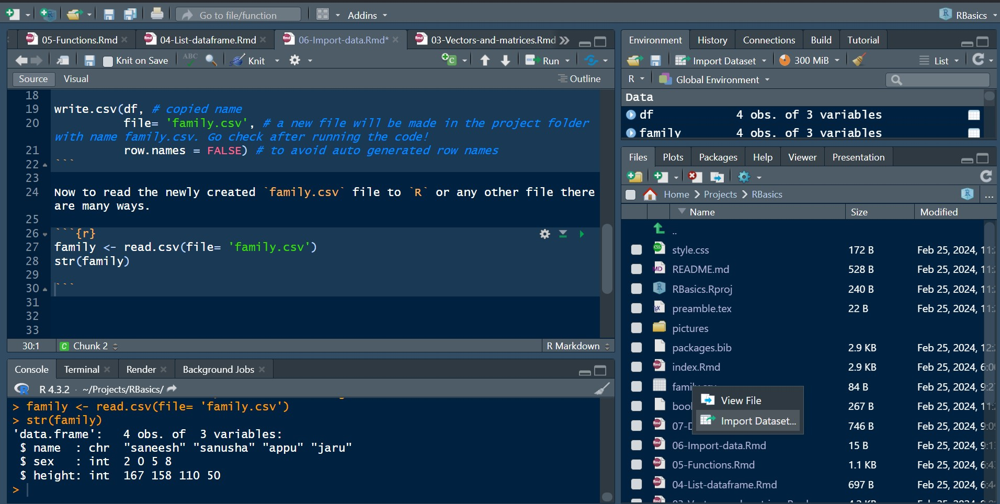
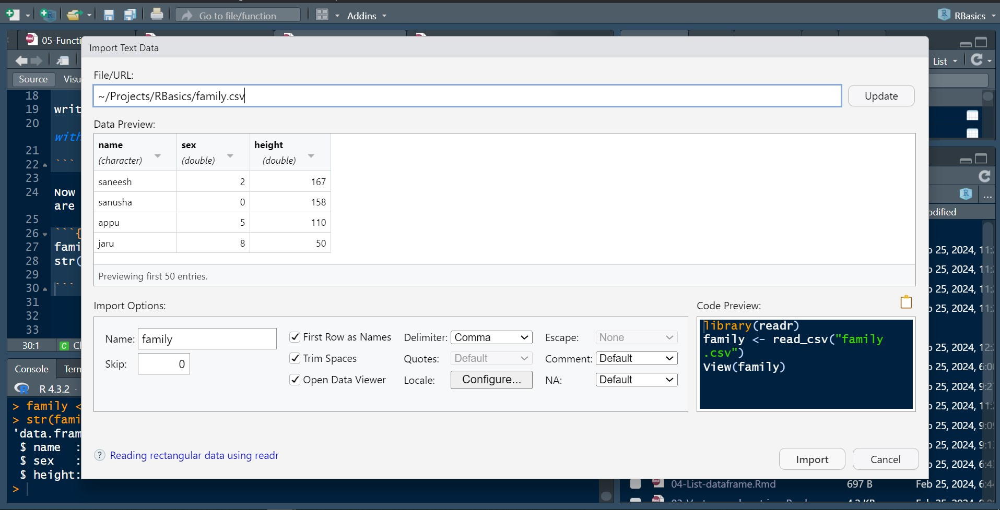

# Import data
## Importing from .csv file
Although creating data frames from existing data structures is extremely useful, by far the most common approach is to create a data frame by importing data from an external file. To do this, you’ll need to have your data correctly formatted and saved in a file format that R is able to recognize. Fortunately for us, R is able to recognize a wide variety of file formats, although in reality you’ll probably end up only using two or three regularly.  
*Saving files to import*
The easiest method of creating a data file to import into R is to enter your data into a spreadsheet using either Microsoft Excel or LibreOffice Calc and save the spreadsheet as a comma delimited file. 
To save a spreadsheet as a comma delimited file in Microsoft Excel or LibreOffice Calc select File -> Save as ... from the main menu. You will need to specify the location (project folder) you want to save your file in the ‘Save in folder’ option and the name of the file in the ‘Name’ option. In the drop down menu located above the ‘Save’ button change the default ‘Save as type:’ to ‘CSV(Comma delimited) (*.csv)’.  

Once you’ve saved your data file in a suitable format we can now read this file into R.  

If you don't have a `*.csv` don't worry, we will make one using the `write.csv` function.

```{r}
df <- # df= data frame
  data.frame(name = c("saneesh", "sanusha", "appu", "jaru"),
             sex = c(2, 0, 5, 8),
             height = c(167, 158, 110, 50))

# copy the name of the data frame `df`

write.csv(df, # copied name
          file= 'family.csv', # a new file will be made in the project folder with name family.csv. Go check after running the code!
          row.names = FALSE) # to avoid auto generated row names
```


## Read .csv
Now to read the newly created `family.csv` file to `R` or any other file there are many ways.

```{r}
family <- read.csv(file= 'family.csv')
str(family)

```

The other method is to import file from `Files`, `Plots`, `Packages` panel.  
Go to `Files`, left click on the .csv file you want to import to `R`, `Import Dataset...` a new window will open, `Import Text Data`

```{r, echo= FALSE, out.width= "100%", fig.align='center', fig.cap= 'Files .csv file'}
 
```


```{r, echo= FALSE, out.width= "100%", fig.align='center', fig.cap= 'Files .csv file'}
  
library(readr)
```

Look at the data preview, import options (change `Name` if needed), click `Import`. or copy code from `code preview`, click on `cancel` and paste the code on the script panel and `Run`. If you don't have `readr` package `R` will show an error, don't worry read the message and `install.packages('readr')` will solve the problem, then run the code again.

