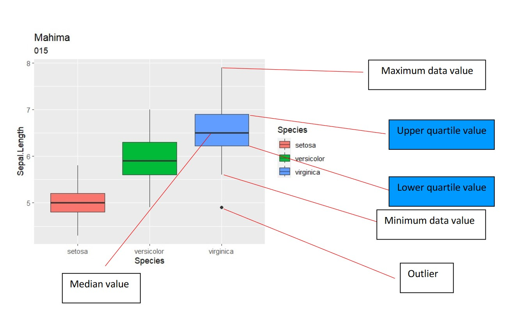

# Data Visualization
Condensing intricate data into numerical summaries inevitably leads to some loss of information. Visualization, though it also involves some information loss, can be less so when executed effectively. A thorough data analysis should always begin with a phase where the analyst deeply familiarizes themselves with the data they're working with. This process of gaining a deep understanding is integral to data analysis, and visualization plays a crucial role in it.  

The vague & defeasible rule of thumb of good data visualization (according to the Edward Tufte).

> “Communicate a maximal degree of relevant true information in a way that minimizes the recipient’s effort of retrieving this information.”

## Scatter plot
`?geom_point`, try to to know more about geom_points
The point geom is used to create scatterplots. The scatterplot is most useful for displaying the relationship between two continuous variables.

### Let us make some data.  
Imagine Shubham and I are planning to do a research on how Cashew and Teak respond to a new fertilizer we invented!!  

To make the data we will use `ggplot2` and `dplyr`, we can use `tidyverse` so both packages will be loaded.

We also want to check if the trees in the fertilizer treatment can store more carbon. I don't know how scientifically correct this is but I am using this resource [Carbon storage calculator](https://naturalresources.wales/media/687190/eng-worksheet-carbon-storage-calculator.pdf). Based on this I wrote a function, read the `Chapter 6` for additional information on functions. 

### carbon calculator function

```{r}
carbon_calc <- function(x) {
  dry_weight = x * 13.0933
  carbon = round(dry_weight / 2)
  return(carbon)
}

carbon_calc(1)
```


```{r}
# treatment (factor)
library(ggplot2)
library(dplyr)

# new df with treatment
set.seed(007) # the name is Bond, James Bond= 007, its just a number. If you want the same result as mine use this set.seed number.
# new df with treatment

treatment <- c(rep('nofertilizer', 50), 
               rep('fertilizer', 50))

name <- c(rep('cashew', 100), 
          rep('teak', 100))

gbh <- c(rnorm(50,
             mean = 15,
             sd = 4),
         rnorm(50,
               mean = 30,
               sd = 6))

df <- data.frame(treatment, 
                 name, 
                 gbh)

str(df)

newdf <- df %>% 
  filter(gbh  >= 15) 

co <- rnorm(length(newdf$gbh), carbon_calc(1), 1.5) # kg

newdf <- newdf %>% 
  mutate(co2= gbh * co) # co2 is a new column based gbh

str(newdf)
names(newdf)

ggplot(data = newdf, aes(x = gbh, y = co2, col= name)) +
  geom_point() +
  geom_smooth(method = 'lm') +
  facet_wrap(~ name)
# To know what facet_wrap is

# ?facet_wrap
# help(facet_wrap)

```
  
## Box plot
A box and whisker plot or diagram (otherwise known as a boxplot), is a graph summarising a set of data. The shape of the boxplot shows how the data is distributed and it also shows any [outliers](https://www.ncl.ac.uk/webtemplate/ask-assets/external/maths-resources/statistics/descriptive-statistics/other-measures-of-dispersion.html#Outliers). It is a useful way to compare different sets of data as you can draw more than one boxplot per graph. These can be displayed alongside a number line, horizontally or vertically.  
*Reading a Box and Whisker Plot*  
Interpreting a boxplot can be done once you understand what the different lines mean on a box and whisker diagram. The line splitting the box in two represents the median value. This shows that 50 % of the data lies on the left hand side of the median value and 50 % lies on the right hand side. The left edge of the box represents the lower [quartile](https://www.ncl.ac.uk/webtemplate/ask-assets/external/maths-resources/statistics/descriptive-statistics/other-measures-of-dispersion.html#Quartiles); it shows the value at which the first 25 % of the data falls up to. The right edge of the box shows the upper [quartile](https://www.ncl.ac.uk/webtemplate/ask-assets/external/maths-resources/statistics/descriptive-statistics/other-measures-of-dispersion.html#Quartiles); it shows that 25 % of the data lies to the right of the upper quartile value. The values at which the horizontal lines stop at are the values of the upper and lower values of the data. The single points on the diagram show the outliers.  
`geom_boxplot` function from `ggplot2` compactly displays the distribution of a continuous variable and a categorical variable, see Figure (Boxplot)  

```{r, echo= FALSE, out.width= "100%", fig.align='center', fig.cap= 'Boxplot'}
  
```

```{r}
ggplot(data = newdf,
       aes(x = treatment,
           y = co2,
           fill = name)) +
  geom_boxplot() +
  facet_wrap( ~ name)

ggplot(data = newdf,
       aes(y = gbh,
           x = treatment,
           fill = name)) +
  geom_boxplot()
```
    
