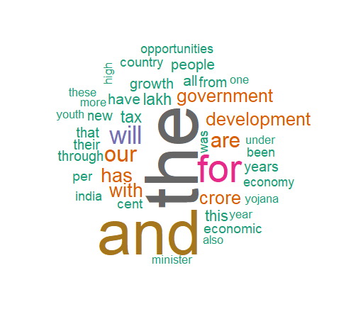

# Wordcloud

## Wordcloud from data frame

```{r}
# install.packages("dplyr")
# install.packages('wordcloud')

# add packages----
library(dplyr) # to clean data
library(wordcloud) # to make wordcloud
```

### Read data

```{r}
words <- data.frame(Name= c(rep('James Bond', 30),
                    rep('Iron Man', 20),
                    rep('Spider Man', 5),
                    rep('Caption America', 4)),
                    Tag= c(rep('Spy', 30),
                               rep('Super hero', 29)),
                    Duty= c(rep('kill', 30),
                            rep('developer', 20),
                            rep('save', 5),
                            rep('save', 4)))

str(words) # display the internal structure `object`, here, our `data`

head(words, 3) # change the number in the () and see more rows
tail(words, 3)
```


```{r}
# let us see what is the duty of our heros
names(words) # to see the column names of words

# to add count to the data
words1 <- words %>% count(Duty) # words1 is a new data frame we created from words
```

```{r}
names(words1)
max(words1$n) # copy this number for max.words=

# par(bg="black") # for black background
```

Before you plot, make sure that the `Files`, `Plot` `Packages` panel is maximized!! click on the rectangular button on top of the File, Plots, Packages window.

```{r}
wordcloud(word = words1$Duty, # BroaderGoal from the words1
          freq = words1$n, # n from the words1 data frame
          min.freq = 1, # minimum frequency of a word
          max.words = 14, # maximum frequency of a word
          random.order=T,
          # colors = brewer.pal(6, 'GnBu') # remove comment from
          # these code one by one and see how color change
          # colors = brewer.pal(6, 'Reds')
          # colors = brewer.pal(6, 'Blues')
          # colors = brewer.pal(1, 'Reds')
          colors=brewer.pal(8, "Dark2")
          )
```

Let us see what are they known as
```{r}
names(words) # to see the column names of words

# know the data
words2 <- words %>% count(Tag)

names(words2)
max(words2$n) # copy this number for max.words=
```


Before you plot, make sure that the plot window or Plot pane is maximized!! click on the rectangular button on top of the `File`, `Plots`, `Packages` window.
```{r}
# par(bg="black") # for black background

wordcloud(word = words2$Tag, # BroderBackground from the words2
          freq = words2$n, # n from the words2 data frame
          min.freq = 1, # minimum frequency of a word
          max.words = 10, # maximum frequency of a word
          random.order=T,
          # vfont= c(family= 'gothic english', face= 'plain'), # fonts, remove comment from
          # these code one by one and see how font and color change
          # vfont= c(family= 'script', face= 'plain'),
          # vfont= c(family= 'serif', face= 'plain'),
          # vfont= c(family= 'sans serif', face= 'plain'),
          vfont= c(family= 'serif', face= 'cyrillic'),
          # colors = brewer.pal(6, 'GnBu') # colors
          colors = brewer.pal(6, 'Reds')
          # colors = brewer.pal(6, 'Blues')
          # colors = brewer.pal(1, 'Reds')
          # colors=brewer.pal(8, "Dark2")
)
```


If the plot doesn't look good restart R from Session tab or press Ctrl+Shift+F10, then start from add packages :). If you want to change background bg= "black" or other colors do the above, restart. If you are happy with a plot,  Export> Save as PDF> select PDF Size> change directory if you want.

## Wordcloud from text data
```{r}
# packages----
# install.packages('tm')
# install.packages('wordcloud')
```

Load packages
```{r}
library(tm)
library(wordcloud)
```

Text
```{r}
mytext <- "India, a vibrant land where ancient traditions dance with modern aspirations, pulsates with the rhythm of diversity. Its people, a kaleidoscope of ethnicities, languages, and religions, paint a masterpiece of cultural richness. From the snow-capped peaks of the Himalayas to the sun-drenched beaches of Goa, India's diversity unfolds in every corner. In bustling metropolises like Mumbai and Delhi, the aroma of spices mingles with the scent of incense, each street alive with the echoes of diverse laughter and prayers. Travel south, and serene temple bells chime in Kerala, their melodies intertwining with the rhythmic beats of Kathakali dancers. Journey east, and the vibrant hues of sarees in Assam blend seamlessly with the bamboo houses of tribal communities. Every region in India whispers its own unique story, its people celebrating their distinct cultures with festivals like Holi, Diwali, and Onam, each a vibrant explosion of colors and traditions. The spirit of India lies in its diversity, a vibrant tapestry woven with countless threads of languages, customs, and beliefs.It is a land where unity thrives amidst difference, where the warmth of its people embraces every visitor, inviting them to experience the magic of its kaleidoscope soul. So, come, explore the diversity of India, and discover a land that will forever captivate your heart." # inside the " "
```

```{r}
mycorpus <- Corpus(VectorSource(mytext))

mycorpus <- tm_map(mycorpus, removePunctuation)
mycorpus <- tm_map(mycorpus, removeNumbers)

mycorpus <- tm_map(mycorpus, removeWords, stopwords("english"))

mywords <- TermDocumentMatrix(mycorpus)
m <- as.matrix(mywords)
v <- sort(rowSums(m), decreasing=TRUE)

#make wordcloud----
wordcloud(names(v), v, scale=c(3,0.5), min.freq = 1,
          max.words=10, random.order=FALSE, rot.per=0.35, 
          colors=brewer.pal(8, "Dark2"))
```


```{r, wordcloud}
# a word cloud for Indian budget
library(rvest)
library(wordcloud)
library(tm)
library(Rgraphviz)

# install.packages("BiocManager")
# BiocManager::install("Rgraphviz")


# budget
# set path to the textfile
budget <- read.delim('budget_speech.txt', fileEncoding="UCS-2LE")

# Remove punctuation and numbers
budget <- gsub("[[:punct:]0-9]", "", budget, useBytes = TRUE)

# covert text to lowercase
budget <- tolower(budget)

# remove stopwords
stopwords <- stopwords('SMART') # options 'english'

budget <- budget[!budget %in% stopwords]


# Create a corpus from the text
corpus <- Corpus(VectorSource(budget))

# Create a term-document matrix
tdm <- TermDocumentMatrix(corpus)

# Convert the tdm to a matrix and calculate word frequencies
matr <- as.matrix(tdm)
word_freq <- sort(rowSums(matr), decreasing = TRUE)
```

```{r, fig.show='hide'}
wordcloud(names(word_freq), 
          word_freq, max.words = 50, # can change number of words 
          random.order = FALSE, 
          colors = brewer.pal(8, "Dark2"))
```

It will look something like this!

```{r, echo= FALSE, out.width= "100%", fig.align='center', fig.cap= 'Budget word cloud'}
 
```


